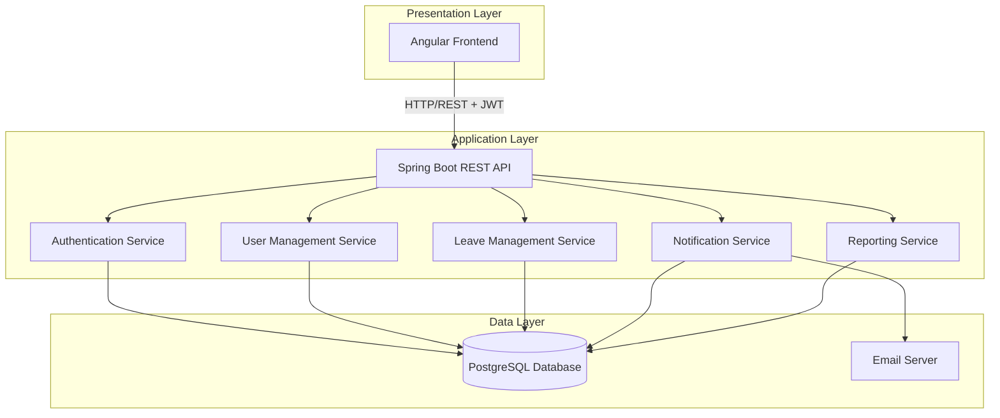
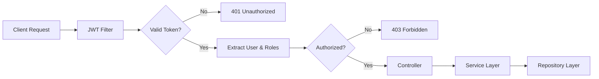
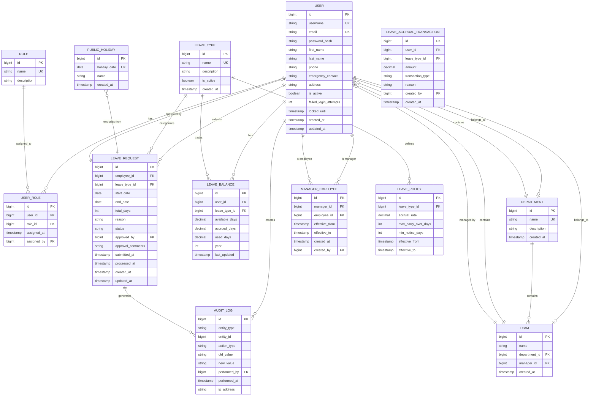

# Design Document: Leave Management System

## Overview

The Leave Management System is a web-based application that enables organizations to manage employee time-off requests through a structured workflow. The system provides three distinct user roles (Employee, Manager, Administrator) with role-specific capabilities for submitting leave requests, approving/denying requests, and managing organizational policies.

### Key Features

- Admin-only user account creation and management
- Role-based access control (Employee, Manager, Administrator)
- Department and team hierarchy management
- Manager-employee relationship tracking
- Leave request submission and approval workflows
- Automated leave balance tracking and accrual
- Visual leave calendar for team availability
- Comprehensive reporting and analytics
- Email notification system
- Public holiday management
- Complete audit trail for compliance

### Technology Stack

- **Backend**: Spring Boot (Java 21) with Spring Security for authentication/authorization
- **Frontend**: Angular with TypeScript
- **Database**: PostgreSQL for relational data storage
- **Authentication**: JWT (JSON Web Tokens) for stateless authentication
- **Email**: Spring Mail for notification delivery

## Architecture

### High-Level Architecture

The system follows a three-tier architecture pattern:



### Architectural Patterns

1. **Layered Architecture**: Clear separation between presentation, business logic, and data access layers
2. **RESTful API**: Stateless HTTP endpoints following REST principles
3. **Repository Pattern**: Data access abstraction through Spring Data JPA repositories
4. **Service Layer**: Business logic encapsulation in service classes
5. **DTO Pattern**: Data Transfer Objects for API request/response isolation
6. **Role-Based Access Control (RBAC)**: Spring Security with custom authorization logic

### Security Architecture



## Components and Interfaces

### Backend Components

#### 1. Authentication Service

**Responsibilities:**
- User authentication with username/password
- JWT token generation and validation
- Session management and timeout enforcement
- Account lockout after failed attempts

**Key Classes:**
- `AuthenticationController`: Handles login/logout endpoints
- `JwtTokenProvider`: Generates and validates JWT tokens
- `UserDetailsServiceImpl`: Loads user details for authentication
- `JwtAuthenticationFilter`: Intercepts requests to validate tokens

**API Endpoints:**
```
POST /api/auth/login
  Request: { usernameOrEmail, password }
  Response: { token, expiresIn, user: { id, username, roles } }

POST /api/auth/logout
  Request: { token }
  Response: { message }

POST /api/auth/refresh
  Request: { token }
  Response: { token, expiresIn }
```

#### 2. User Management Service

**Responsibilities:**
- User account CRUD operations (admin-only)
- Role assignment and management
- Department and team management
- Manager-employee relationship management
- User profile updates
- Password reset functionality

**Key Classes:**
- `UserManagementController`: REST endpoints for user operations
- `UserService`: Business logic for user management
- `RoleService`: Role assignment logic
- `DepartmentService`: Department/team management
- `ManagerRelationshipService`: Manager-employee relationship logic

**API Endpoints:**
```
POST /api/admin/users
  Request: { username, email, firstName, lastName, roles[], departmentId, managerId }
  Response: { userId, temporaryPassword }

PUT /api/admin/users/{userId}
  Request: { firstName, lastName, email, phone, address }
  Response: { user }

POST /api/admin/users/{userId}/roles
  Request: { roles[] }
  Response: { user }

POST /api/admin/users/{userId}/deactivate
  Response: { message }

POST /api/admin/users/{userId}/reset-password
  Response: { message }

GET /api/admin/users
  Query: page, size, departmentId, status
  Response: { users[], totalCount }

POST /api/admin/departments
  Request: { name, description }
  Response: { department }

POST /api/admin/teams
  Request: { name, departmentId, managerId }
  Response: { team }

PUT /api/admin/users/{userId}/manager
  Request: { managerId }
  Response: { message }
```

#### 3. Leave Management Service

**Responsibilities:**
- Leave request submission and validation
- Leave approval/denial workflow
- Leave balance calculation and tracking
- Leave cancellation logic
- Leave calendar generation
- Leave policy enforcement

**Key Classes:**
- `LeaveRequestController`: REST endpoints for leave operations
- `LeaveRequestService`: Leave request business logic
- `LeaveBalanceService`: Balance calculation and tracking
- `LeaveApprovalService`: Approval workflow logic
- `LeaveCalendarService`: Calendar data generation
- `LeavePolicyService`: Policy validation logic

**API Endpoints:**
```
POST /api/leave/requests
  Request: { 
    leaveTypeId, 
    startDate, 
    endDate, 
    durationType,
    sessionType?,      // Required for HALF_DAY
    durationInHours?,  // Required for HOURLY
    reason 
  }
  Response: { leaveRequest }

GET /api/leave/requests
  Query: status, startDate, endDate, durationType
  Response: { leaveRequests[] }

GET /api/leave/requests/{requestId}
  Response: { leaveRequest }

PUT /api/leave/requests/{requestId}/approve
  Request: { comments }
  Response: { leaveRequest }

PUT /api/leave/requests/{requestId}/deny
  Request: { reason }
  Response: { leaveRequest }

DELETE /api/leave/requests/{requestId}
  Response: { message }

GET /api/leave/balance
  Response: { balances: [{ leaveType, available, accrued, used, availableHours, usedHours }] }

GET /api/leave/calendar
  Query: startDate, endDate, teamId, leaveTypeId
  Response: { leaveEntries[] }

GET /api/manager/pending-requests
  Response: { leaveRequests[] }
```

#### 4. Leave Policy Service

**Responsibilities:**
- Leave type configuration
- Accrual rate management
- Policy rule enforcement
- Carry-over limit management
- Public holiday management

**Key Classes:**
- `LeavePolicyController`: REST endpoints for policy configuration
- `LeaveTypeService`: Leave type management
- `AccrualService`: Accrual calculation logic
- `PublicHolidayService`: Holiday management

**API Endpoints:**
```
POST /api/admin/leave-types
  Request: { name, description, accrualRate, maxCarryOver, minNoticeDays }
  Response: { leaveType }

GET /api/leave-types
  Response: { leaveTypes[] }

PUT /api/admin/leave-types/{typeId}
  Request: { name, description, accrualRate, maxCarryOver, minNoticeDays }
  Response: { leaveType }

POST /api/admin/public-holidays
  Request: { date, name }
  Response: { holiday }

POST /api/admin/public-holidays/import
  Request: FormData with CSV file
  Response: { importedCount }

GET /api/public-holidays
  Query: year
  Response: { holidays[] }
```

#### 5. Leave Accrual Service

**Responsibilities:**
- Automated leave accrual processing
- Balance adjustment logic
- Carry-over limit enforcement
- Accrual transaction recording

**Key Classes:**
- `AccrualScheduler`: Scheduled job for periodic accrual
- `AccrualService`: Accrual calculation and processing
- `BalanceAdjustmentService`: Manual balance adjustments

**API Endpoints:**
```
POST /api/admin/leave-balance/adjust
  Request: { userId, leaveTypeId, amount, reason }
  Response: { newBalance }

POST /api/admin/accrual/process
  Response: { processedCount }
```

#### 6. Reporting Service

**Responsibilities:**
- Report generation for various metrics
- Data aggregation and analysis
- CSV export functionality
- Trend analysis

**Key Classes:**
- `ReportingController`: REST endpoints for reports
- `LeaveReportService`: Report generation logic
- `ReportExportService`: CSV export functionality

**API Endpoints:**
```
GET /api/admin/reports/leave-usage
  Query: startDate, endDate, departmentId, leaveTypeId
  Response: { reportData }

GET /api/admin/reports/leave-balances
  Query: departmentId
  Response: { balances[] }

GET /api/admin/reports/pending-requests
  Response: { requests[] }

GET /api/admin/reports/leave-trends
  Query: startDate, endDate, groupBy
  Response: { trends[] }

GET /api/admin/reports/export
  Query: reportType, format, filters
  Response: CSV file download
```

#### 7. Notification Service

**Responsibilities:**
- Email notification delivery
- Notification template management
- Event-driven notification triggering

**Key Classes:**
- `NotificationService`: Email sending logic
- `NotificationTemplateService`: Template management
- `NotificationEventListener`: Event-driven notification triggers

**Events Triggering Notifications:**
- Leave request submitted → Notify manager
- Leave request approved/denied → Notify employee
- Leave request cancelled → Notify manager
- Leave starting in 2 days → Notify employee
- User account created → Send temporary password
- Password reset → Send temporary password

#### 8. Audit Service

**Responsibilities:**
- Audit trail recording
- Audit log querying
- Compliance reporting

**Key Classes:**
- `AuditService`: Audit log recording
- `AuditController`: Audit log query endpoints
- `AuditEventListener`: Automatic audit logging

**API Endpoints:**
```
GET /api/admin/audit
  Query: userId, actionType, startDate, endDate, page, size
  Response: { auditLogs[], totalCount }
```

### Frontend Components

#### Angular Module Structure

```
src/app/
├── core/
│   ├── auth/
│   │   ├── auth.service.ts
│   │   ├── auth.guard.ts
│   │   ├── jwt.interceptor.ts
│   │   └── role.guard.ts
│   ├── services/
│   │   ├── api.service.ts
│   │   └── notification.service.ts
│   └── models/
│       ├── user.model.ts
│       ├── leave-request.model.ts
│       └── leave-balance.model.ts
├── features/
│   ├── auth/
│   │   ├── login/
│   │   └── logout/
│   ├── user-management/ (Admin only)
│   │   ├── user-list/
│   │   ├── user-create/
│   │   ├── user-edit/
│   │   ├── department-management/
│   │   └── team-management/
│   ├── leave-requests/
│   │   ├── request-form/
│   │   ├── request-list/
│   │   ├── request-detail/
│   │   └── leave-balance/
│   ├── leave-approval/ (Manager only)
│   │   ├── pending-requests/
│   │   └── team-calendar/
│   ├── leave-calendar/
│   │   └── calendar-view/
│   ├── reports/ (Admin only)
│   │   ├── leave-usage-report/
│   │   ├── balance-report/
│   │   └── audit-report/
│   └── leave-policy/ (Admin only)
│       ├── leave-type-management/
│       └── holiday-management/
├── shared/
│   ├── components/
│   │   ├── header/
│   │   ├── sidebar/
│   │   ├── date-picker/
│   │   └── data-table/
│   └── pipes/
│       └── date-format.pipe.ts
└── app-routing.module.ts
```

#### Key Frontend Components

**1. Authentication Components**
- `LoginComponent`: User login form
- `AuthService`: Handles authentication state and JWT storage
- `JwtInterceptor`: Attaches JWT to outgoing requests
- `AuthGuard`: Protects routes requiring authentication
- `RoleGuard`: Protects routes requiring specific roles

**2. User Management Components (Admin Only)**
- `UserListComponent`: Displays all users with search/filter
- `UserCreateComponent`: Form for creating new users
- `UserEditComponent`: Form for editing user details
- `DepartmentManagementComponent`: Department CRUD operations
- `TeamManagementComponent`: Team CRUD operations

**3. Leave Request Components**
- `LeaveRequestFormComponent`: Form for submitting leave requests
- `LeaveRequestListComponent`: Displays user's leave requests
- `LeaveBalanceComponent`: Shows current leave balances
- `LeaveRequestDetailComponent`: Detailed view of a single request

**4. Leave Approval Components (Manager Only)**
- `PendingRequestsComponent`: List of pending requests from team
- `TeamCalendarComponent`: Visual calendar of team leave

**5. Leave Calendar Components**
- `CalendarViewComponent`: Interactive calendar showing approved leave
- Uses a calendar library (e.g., FullCalendar) for visualization

**6. Reporting Components (Admin Only)**
- `LeaveUsageReportComponent`: Leave usage statistics
- `BalanceReportComponent`: Employee balance overview
- `AuditReportComponent`: Audit trail viewer

**7. Leave Policy Components (Admin Only)**
- `LeaveTypeManagementComponent`: Configure leave types
- `HolidayManagementComponent`: Manage public holidays

## Data Models

### Database Schema



### Entity Definitions

#### User Entity
```java
@Entity
@Table(name = "users")
public class User {
    @Id
    @GeneratedValue(strategy = GenerationType.IDENTITY)
    private Long id;
    
    @Column(unique = true, nullable = false)
    private String username;
    
    @Column(unique = true, nullable = false)
    private String email;
    
    @Column(nullable = false)
    private String passwordHash;
    
    private String firstName;
    private String lastName;
    private String phone;
    private String emergencyContact;
    private String address;
    
    @Column(nullable = false)
    private Boolean isActive = true;
    
    private Integer failedLoginAttempts = 0;
    private LocalDateTime lockedUntil;
    
    @ManyToOne
    @JoinColumn(name = "department_id")
    private Department department;
    
    @ManyToOne
    @JoinColumn(name = "team_id")
    private Team team;
    
    @ManyToMany(fetch = FetchType.EAGER)
    @JoinTable(
        name = "user_roles",
        joinColumns = @JoinColumn(name = "user_id"),
        inverseJoinColumns = @JoinColumn(name = "role_id")
    )
    private Set<Role> roles = new HashSet<>();
    
    @CreationTimestamp
    private LocalDateTime createdAt;
    
    @UpdateTimestamp
    private LocalDateTime updatedAt;
}
```

#### LeaveRequest Entity
```java
@Entity
@Table(name = "leave_requests")
public class LeaveRequest {
    @Id
    @GeneratedValue(strategy = GenerationType.IDENTITY)
    private Long id;
    
    @ManyToOne(optional = false)
    @JoinColumn(name = "employee_id")
    private User employee;
    
    @ManyToOne(optional = false)
    @JoinColumn(name = "leave_type_id")
    private LeaveType leaveType;
    
    @Column(nullable = false)
    private LocalDate startDate;
    
    @Column(nullable = false)
    private LocalDate endDate;
    
    @Enumerated(EnumType.STRING)
    @Column(nullable = false)
    private LeaveDurationType durationType;
    
    @Enumerated(EnumType.STRING)
    private SessionType sessionType;  // For half-day leaves
    
    private BigDecimal durationInHours;  // For hourly permissions
    
    private BigDecimal totalDays;  // Changed to BigDecimal to support fractional days
    
    @Column(length = 1000)
    private String reason;
    
    @Enumerated(EnumType.STRING)
    @Column(nullable = false)
    private LeaveRequestStatus status;
    
    @ManyToOne
    @JoinColumn(name = "approved_by")
    private User approvedBy;
    
    private String approvalComments;
    
    @CreationTimestamp
    private LocalDateTime submittedAt;
    
    private LocalDateTime processedAt;
    
    @UpdateTimestamp
    private LocalDateTime updatedAt;
}

public enum LeaveRequestStatus {
    PENDING, APPROVED, DENIED, CANCELLED
}

public enum LeaveDurationType {
    FULL_DAY,      // Traditional full-day leave
    HALF_DAY,      // Half-day leave (morning or afternoon)
    HOURLY         // Short-term permission in hours
}

public enum SessionType {
    MORNING,       // First half of the day (e.g., 9 AM - 1 PM)
    AFTERNOON      // Second half of the day (e.g., 2 PM - 6 PM)
}
```

#### LeaveBalance Entity
```java
@Entity
@Table(name = "leave_balances")
public class LeaveBalance {
    @Id
    @GeneratedValue(strategy = GenerationType.IDENTITY)
    private Long id;
    
    @ManyToOne(optional = false)
    @JoinColumn(name = "user_id")
    private User user;
    
    @ManyToOne(optional = false)
    @JoinColumn(name = "leave_type_id")
    private LeaveType leaveType;
    
    @Column(nullable = false)
    private BigDecimal availableDays;  // Supports fractional days (e.g., 10.5 days)
    
    private BigDecimal accruedDays;
    private BigDecimal usedDays;
    
    private BigDecimal availableHours;  // For hourly permissions tracking
    private BigDecimal usedHours;
    
    @Column(nullable = false)
    private Integer year;
    
    @UpdateTimestamp
    private LocalDateTime lastUpdated;
}
```

### DTOs (Data Transfer Objects)

#### CreateUserRequest
```java
public class CreateUserRequest {
    @NotBlank
    private String username;
    
    @Email
    @NotBlank
    private String email;
    
    @NotBlank
    private String firstName;
    
    @NotBlank
    private String lastName;
    
    @NotEmpty
    private Set<String> roles;
    
    private Long departmentId;
    private Long managerId;
}
```

#### LeaveRequestDTO
```java
public class LeaveRequestDTO {
    @NotNull
    private Long leaveTypeId;
    
    @NotNull
    @Future
    private LocalDate startDate;
    
    @NotNull
    @Future
    private LocalDate endDate;
    
    @NotNull
    private LeaveDurationType durationType;
    
    // Required when durationType is HALF_DAY
    private SessionType sessionType;
    
    // Required when durationType is HOURLY
    @DecimalMin(value = "0.5", message = "Duration must be at least 0.5 hours")
    @DecimalMax(value = "8.0", message = "Duration cannot exceed 8 hours")
    private BigDecimal durationInHours;
    
    @NotBlank
    @Size(max = 1000)
    private String reason;
    
    // Validation method
    @AssertTrue(message = "Session type is required for half-day leaves")
    private boolean isSessionTypeValid() {
        if (durationType == LeaveDurationType.HALF_DAY) {
            return sessionType != null;
        }
        return true;
    }
    
    @AssertTrue(message = "Duration in hours is required for hourly permissions")
    private boolean isDurationInHoursValid() {
        if (durationType == LeaveDurationType.HOURLY) {
            return durationInHours != null && durationInHours.compareTo(BigDecimal.ZERO) > 0;
        }
        return true;
    }
    
    @AssertTrue(message = "For hourly permissions, start date and end date must be the same")
    private boolean isHourlyDateRangeValid() {
        if (durationType == LeaveDurationType.HOURLY) {
            return startDate != null && endDate != null && startDate.equals(endDate);
        }
        return true;
    }
    
    @AssertTrue(message = "For half-day leaves, start date and end date must be the same")
    private boolean isHalfDayDateRangeValid() {
        if (durationType == LeaveDurationType.HALF_DAY) {
            return startDate != null && endDate != null && startDate.equals(endDate);
        }
        return true;
    }
}
```

#### LeaveBalanceResponse
```java
public class LeaveBalanceResponse {
    private Long leaveTypeId;
    private String leaveTypeName;
    private BigDecimal availableDays;
    private BigDecimal accruedDays;
    private BigDecimal usedDays;
    private BigDecimal accrualRate;
    private BigDecimal availableHours;  // For hourly permissions
    private BigDecimal usedHours;
}
```


## Security Implementation

### Authentication Flow

1. **Login Process:**
   - User submits username or email and password via the `/api/auth/login` endpoint
   - AuthenticationService calls `findByUsernameOrEmail()` to locate the user by either username or email
   - System validates credentials against hashed password in database
   - System checks if account is locked using `isAccountLocked()`
   - On success, generate JWT token with user ID, username, and roles
   - Call `handleSuccessfulLogin()` to reset failed login attempts
   - Return token to client with expiration time (30 minutes)
   - Client stores token in memory or sessionStorage (not localStorage for security)
   - On failure, call `handleFailedLogin()` to increment failed attempts and potentially lock account

2. **Request Authentication:**
   - Client includes JWT in Authorization header: `Bearer <token>`
   - JwtAuthenticationFilter intercepts request
   - Filter validates token signature and expiration
   - Extract user details and roles from token
   - Set authentication in SecurityContext
   - Proceed to controller if valid, return 401 if invalid

3. **Session Management:**
   - Track last activity timestamp
   - Implement automatic logout after 30 minutes of inactivity
   - Frontend periodically checks token expiration
   - Provide token refresh endpoint for active sessions

### Authorization Strategy

**Role-Based Access Control (RBAC):**

```java
@Configuration
@EnableWebSecurity
@EnableMethodSecurity
public class SecurityConfig {
    
    @Bean
    public SecurityFilterChain filterChain(HttpSecurity http) throws Exception {
        http
            .csrf().disable()
            .sessionManagement()
                .sessionCreationPolicy(SessionCreationPolicy.STATELESS)
            .and()
            .authorizeHttpRequests(auth -> auth
                .requestMatchers("/api/auth/**").permitAll()
                .requestMatchers("/api/admin/**").hasRole("ADMINISTRATOR")
                .requestMatchers("/api/manager/**").hasAnyRole("MANAGER", "ADMINISTRATOR")
                .requestMatchers("/api/leave/**").hasAnyRole("EMPLOYEE", "MANAGER", "ADMINISTRATOR")
                .anyRequest().authenticated()
            )
            .addFilterBefore(jwtAuthenticationFilter, UsernamePasswordAuthenticationFilter.class);
        
        return http.build();
    }
}
```

**Method-Level Security:**

```java
@Service
public class UserService {
    
    @PreAuthorize("hasRole('ADMINISTRATOR')")
    public User createUser(CreateUserRequest request) {
        // Only administrators can create users
    }
    
    @PreAuthorize("hasRole('ADMINISTRATOR') or #userId == authentication.principal.id")
    public User getUserById(Long userId) {
        // Administrators can view any user, others can only view themselves
    }
}
```

### Password Security

1. **Password Hashing:**
   - Use BCrypt with strength factor of 12
   - Salt automatically generated per password
   - Never store plaintext passwords

```java
@Service
public class PasswordService {
    
    private final PasswordEncoder passwordEncoder = new BCryptPasswordEncoder(12);
    
    public String hashPassword(String plainPassword) {
        return passwordEncoder.encode(plainPassword);
    }
    
    public boolean verifyPassword(String plainPassword, String hashedPassword) {
        return passwordEncoder.matches(plainPassword, hashedPassword);
    }
    
    public String generateTemporaryPassword() {
        return RandomStringUtils.randomAlphanumeric(12);
    }
}
```

2. **Password Reset:**
   - Generate secure random temporary password
   - Hash and store in database
   - Send to user's email
   - Force password change on first login (future enhancement)

### Account Lockout

```java
@Service
public class AuthenticationService {
    
    @Autowired
    private UserRepository userRepository;
    
    private static final int MAX_FAILED_ATTEMPTS = 3;
    private static final int LOCKOUT_DURATION_MINUTES = 15;
    
    /**
     * Find user by username or email for authentication
     * @param usernameOrEmail The username or email provided by the user
     * @return User if found, null otherwise
     */
    public User findByUsernameOrEmail(String usernameOrEmail) {
        // Try to find by username first
        User user = userRepository.findByUsername(usernameOrEmail);
        
        // If not found, try to find by email
        if (user == null) {
            user = userRepository.findByEmail(usernameOrEmail);
        }
        
        return user;
    }
    
    public void handleFailedLogin(User user) {
        user.setFailedLoginAttempts(user.getFailedLoginAttempts() + 1);
        
        if (user.getFailedLoginAttempts() >= MAX_FAILED_ATTEMPTS) {
            user.setLockedUntil(LocalDateTime.now().plusMinutes(LOCKOUT_DURATION_MINUTES));
        }
        
        userRepository.save(user);
    }
    
    public void handleSuccessfulLogin(User user) {
        user.setFailedLoginAttempts(0);
        user.setLockedUntil(null);
        userRepository.save(user);
    }
    
    public boolean isAccountLocked(User user) {
        if (user.getLockedUntil() == null) {
            return false;
        }
        
        if (LocalDateTime.now().isAfter(user.getLockedUntil())) {
            user.setLockedUntil(null);
            user.setFailedLoginAttempts(0);
            userRepository.save(user);
            return false;
        }
        
        return true;
    }
}
```

### JWT Token Structure

```json
{
  "sub": "john.doe",
  "userId": 123,
  "roles": ["EMPLOYEE", "MANAGER"],
  "iat": 1234567890,
  "exp": 1234569690
}
```

### Input Validation

- Use Bean Validation annotations (@NotNull, @NotBlank, @Email, @Size, etc.)
- Validate all user inputs at controller level
- Sanitize inputs to prevent SQL injection (JPA handles this)
- Validate date ranges (start date before end date)
- Validate business rules (sufficient leave balance, no overlapping requests)

### CORS Configuration

```java
@Configuration
public class CorsConfig {
    
    @Bean
    public CorsConfigurationSource corsConfigurationSource() {
        CorsConfiguration configuration = new CorsConfiguration();
        configuration.setAllowedOrigins(Arrays.asList("http://localhost:4200"));
        configuration.setAllowedMethods(Arrays.asList("GET", "POST", "PUT", "DELETE", "OPTIONS"));
        configuration.setAllowedHeaders(Arrays.asList("*"));
        configuration.setAllowCredentials(true);
        
        UrlBasedCorsConfigurationSource source = new UrlBasedCorsConfigurationSource();
        source.registerCorsConfiguration("/api/**", configuration);
        return source;
    }
}
```

## Error Handling

### Exception Hierarchy

```java
// Base exception
public class LeaveManagementException extends RuntimeException {
    private final String errorCode;
    
    public LeaveManagementException(String message, String errorCode) {
        super(message);
        this.errorCode = errorCode;
    }
}

// Specific exceptions
public class InsufficientLeaveBalanceException extends LeaveManagementException {
    public InsufficientLeaveBalanceException(String message) {
        super(message, "INSUFFICIENT_BALANCE");
    }
}

public class OverlappingLeaveRequestException extends LeaveManagementException {
    public OverlappingLeaveRequestException(String message) {
        super(message, "OVERLAPPING_REQUEST");
    }
}

public class UnauthorizedAccessException extends LeaveManagementException {
    public UnauthorizedAccessException(String message) {
        super(message, "UNAUTHORIZED");
    }
}

public class ResourceNotFoundException extends LeaveManagementException {
    public ResourceNotFoundException(String message) {
        super(message, "NOT_FOUND");
    }
}

public class PolicyViolationException extends LeaveManagementException {
    public PolicyViolationException(String message) {
        super(message, "POLICY_VIOLATION");
    }
}
```

### Global Exception Handler

```java
@RestControllerAdvice
public class GlobalExceptionHandler {
    
    @ExceptionHandler(LeaveManagementException.class)
    public ResponseEntity<ErrorResponse> handleLeaveManagementException(
            LeaveManagementException ex, HttpServletRequest request) {
        
        ErrorResponse error = new ErrorResponse(
            ex.getErrorCode(),
            ex.getMessage(),
            request.getRequestURI(),
            LocalDateTime.now()
        );
        
        HttpStatus status = determineHttpStatus(ex.getErrorCode());
        return ResponseEntity.status(status).body(error);
    }
    
    @ExceptionHandler(MethodArgumentNotValidException.class)
    public ResponseEntity<ErrorResponse> handleValidationException(
            MethodArgumentNotValidException ex, HttpServletRequest request) {
        
        Map<String, String> fieldErrors = new HashMap<>();
        ex.getBindingResult().getFieldErrors().forEach(error -> 
            fieldErrors.put(error.getField(), error.getDefaultMessage())
        );
        
        ErrorResponse error = new ErrorResponse(
            "VALIDATION_ERROR",
            "Input validation failed",
            request.getRequestURI(),
            LocalDateTime.now(),
            fieldErrors
        );
        
        return ResponseEntity.status(HttpStatus.BAD_REQUEST).body(error);
    }
    
    @ExceptionHandler(Exception.class)
    public ResponseEntity<ErrorResponse> handleGenericException(
            Exception ex, HttpServletRequest request) {
        
        ErrorResponse error = new ErrorResponse(
            "INTERNAL_ERROR",
            "An unexpected error occurred",
            request.getRequestURI(),
            LocalDateTime.now()
        );
        
        return ResponseEntity.status(HttpStatus.INTERNAL_SERVER_ERROR).body(error);
    }
    
    private HttpStatus determineHttpStatus(String errorCode) {
        return switch (errorCode) {
            case "NOT_FOUND" -> HttpStatus.NOT_FOUND;
            case "UNAUTHORIZED" -> HttpStatus.FORBIDDEN;
            case "INSUFFICIENT_BALANCE", "OVERLAPPING_REQUEST", "POLICY_VIOLATION" 
                -> HttpStatus.BAD_REQUEST;
            default -> HttpStatus.INTERNAL_SERVER_ERROR;
        };
    }
}

public class ErrorResponse {
    private String errorCode;
    private String message;
    private String path;
    private LocalDateTime timestamp;
    private Map<String, String> fieldErrors;
    
    // Constructors, getters, setters
}
```

### Frontend Error Handling

```typescript
@Injectable()
export class ErrorInterceptor implements HttpInterceptor {
  
  constructor(private notificationService: NotificationService) {}
  
  intercept(req: HttpRequest<any>, next: HttpHandler): Observable<HttpEvent<any>> {
    return next.handle(req).pipe(
      catchError((error: HttpErrorResponse) => {
        let errorMessage = 'An error occurred';
        
        if (error.error instanceof ErrorEvent) {
          // Client-side error
          errorMessage = error.error.message;
        } else {
          // Server-side error
          if (error.status === 401) {
            // Redirect to login
            this.router.navigate(['/login']);
          } else if (error.error?.message) {
            errorMessage = error.error.message;
          }
        }
        
        this.notificationService.showError(errorMessage);
        return throwError(() => error);
      })
    );
  }
}
```

## Testing Strategy

### Unit Testing

**Backend Unit Tests (JUnit 5 + Mockito):**

Test individual service methods with mocked dependencies:

```java
@ExtendWith(MockitoExtension.class)
class LeaveRequestServiceTest {
    
    @Mock
    private LeaveRequestRepository leaveRequestRepository;
    
    @Mock
    private LeaveBalanceService leaveBalanceService;
    
    @Mock
    private NotificationService notificationService;
    
    @InjectMocks
    private LeaveRequestService leaveRequestService;
    
    @Test
    void submitLeaveRequest_WithSufficientBalance_ShouldSucceed() {
        // Arrange
        User employee = createTestEmployee();
        LeaveRequestDTO dto = createValidLeaveRequest();
        when(leaveBalanceService.getAvailableBalance(any(), any()))
            .thenReturn(BigDecimal.valueOf(10));
        
        // Act
        LeaveRequest result = leaveRequestService.submitLeaveRequest(employee, dto);
        
        // Assert
        assertNotNull(result);
        assertEquals(LeaveRequestStatus.PENDING, result.getStatus());
        verify(notificationService).sendLeaveRequestNotification(any());
    }
    
    @Test
    void submitLeaveRequest_WithInsufficientBalance_ShouldThrowException() {
        // Arrange
        User employee = createTestEmployee();
        LeaveRequestDTO dto = createValidLeaveRequest();
        when(leaveBalanceService.getAvailableBalance(any(), any()))
            .thenReturn(BigDecimal.valueOf(2));
        
        // Act & Assert
        assertThrows(InsufficientLeaveBalanceException.class, () -> 
            leaveRequestService.submitLeaveRequest(employee, dto)
        );
    }
    
    @Test
    void submitLeaveRequest_WithOverlappingDates_ShouldThrowException() {
        // Arrange
        User employee = createTestEmployee();
        LeaveRequestDTO dto = createValidLeaveRequest();
        when(leaveRequestRepository.findOverlappingRequests(any(), any(), any()))
            .thenReturn(List.of(new LeaveRequest()));
        
        // Act & Assert
        assertThrows(OverlappingLeaveRequestException.class, () -> 
            leaveRequestService.submitLeaveRequest(employee, dto)
        );
    }
}
```

**Frontend Unit Tests (Jasmine + Karma):**

```typescript
describe('LeaveRequestFormComponent', () => {
  let component: LeaveRequestFormComponent;
  let fixture: ComponentFixture<LeaveRequestFormComponent>;
  let leaveService: jasmine.SpyObj<LeaveService>;
  
  beforeEach(() => {
    const leaveServiceSpy = jasmine.createSpyObj('LeaveService', ['submitRequest']);
    
    TestBed.configureTestingModule({
      declarations: [LeaveRequestFormComponent],
      providers: [
        { provide: LeaveService, useValue: leaveServiceSpy }
      ]
    });
    
    fixture = TestBed.createComponent(LeaveRequestFormComponent);
    component = fixture.componentInstance;
    leaveService = TestBed.inject(LeaveService) as jasmine.SpyObj<LeaveService>;
  });
  
  it('should create', () => {
    expect(component).toBeTruthy();
  });
  
  it('should validate start date is before end date', () => {
    component.form.patchValue({
      startDate: new Date('2024-02-01'),
      endDate: new Date('2024-01-01')
    });
    
    expect(component.form.valid).toBeFalse();
  });
  
  it('should submit valid leave request', () => {
    const mockRequest = { /* valid request data */ };
    leaveService.submitRequest.and.returnValue(of(mockRequest));
    
    component.form.patchValue(mockRequest);
    component.onSubmit();
    
    expect(leaveService.submitRequest).toHaveBeenCalledWith(mockRequest);
  });
});
```

### Integration Testing

**Backend Integration Tests (Spring Boot Test):**

Test complete request-response cycles with real database:

```java
@SpringBootTest(webEnvironment = WebEnvironment.RANDOM_PORT)
@AutoConfigureTestDatabase
@Transactional
class LeaveRequestIntegrationTest {
    
    @Autowired
    private TestRestTemplate restTemplate;
    
    @Autowired
    private UserRepository userRepository;
    
    @Autowired
    private LeaveTypeRepository leaveTypeRepository;
    
    private String jwtToken;
    
    @BeforeEach
    void setup() {
        // Create test user and authenticate
        User testUser = createAndSaveTestUser();
        jwtToken = authenticateAndGetToken(testUser);
    }
    
    @Test
    void submitLeaveRequest_AsEmployee_ShouldReturn201() {
        // Arrange
        LeaveRequestDTO request = new LeaveRequestDTO();
        request.setLeaveTypeId(1L);
        request.setStartDate(LocalDate.now().plusDays(7));
        request.setEndDate(LocalDate.now().plusDays(10));
        request.setReason("Vacation");
        
        HttpHeaders headers = new HttpHeaders();
        headers.setBearerAuth(jwtToken);
        HttpEntity<LeaveRequestDTO> entity = new HttpEntity<>(request, headers);
        
        // Act
        ResponseEntity<LeaveRequest> response = restTemplate.postForEntity(
            "/api/leave/requests", entity, LeaveRequest.class
        );
        
        // Assert
        assertEquals(HttpStatus.CREATED, response.getStatusCode());
        assertNotNull(response.getBody());
        assertEquals(LeaveRequestStatus.PENDING, response.getBody().getStatus());
    }
    
    @Test
    void accessAdminEndpoint_AsEmployee_ShouldReturn403() {
        // Arrange
        HttpHeaders headers = new HttpHeaders();
        headers.setBearerAuth(jwtToken);
        HttpEntity<Void> entity = new HttpEntity<>(headers);
        
        // Act
        ResponseEntity<String> response = restTemplate.exchange(
            "/api/admin/users", HttpMethod.GET, entity, String.class
        );
        
        // Assert
        assertEquals(HttpStatus.FORBIDDEN, response.getStatusCode());
    }
}
```

### End-to-End Testing

Use Cypress or Selenium for frontend E2E tests:

```typescript
describe('Leave Request Flow', () => {
  beforeEach(() => {
    cy.login('employee@example.com', 'password');
  });
  
  it('should submit a leave request successfully', () => {
    cy.visit('/leave/request');
    
    cy.get('[data-cy=leave-type]').select('Annual Leave');
    cy.get('[data-cy=start-date]').type('2024-03-01');
    cy.get('[data-cy=end-date]').type('2024-03-05');
    cy.get('[data-cy=reason]').type('Family vacation');
    
    cy.get('[data-cy=submit-button]').click();
    
    cy.get('[data-cy=success-message]').should('be.visible');
    cy.url().should('include', '/leave/requests');
  });
  
  it('should show validation error for overlapping dates', () => {
    // Create existing request first
    cy.createLeaveRequest('2024-03-01', '2024-03-05');
    
    cy.visit('/leave/request');
    cy.get('[data-cy=start-date]').type('2024-03-03');
    cy.get('[data-cy=end-date]').type('2024-03-07');
    cy.get('[data-cy=submit-button]').click();
    
    cy.get('[data-cy=error-message]')
      .should('contain', 'overlapping');
  });
});
```

### Test Coverage Goals

- **Backend**: Minimum 80% code coverage
  - Service layer: 90%+ coverage
  - Controller layer: 80%+ coverage
  - Repository layer: Covered by integration tests
  
- **Frontend**: Minimum 70% code coverage
  - Components: 75%+ coverage
  - Services: 85%+ coverage
  - Guards/Interceptors: 90%+ coverage

### Performance Testing

Use JMeter or Gatling for load testing:

- Test concurrent leave request submissions
- Test manager approval workflow under load
- Test report generation with large datasets
- Target: Support 100 concurrent users with <2s response time

## Deployment Considerations

### Environment Configuration

```yaml
# application.yml
spring:
  profiles:
    active: ${ENVIRONMENT:dev}
  
  datasource:
    url: ${DB_URL}
    username: ${DB_USERNAME}
    password: ${DB_PASSWORD}
  
  jpa:
    hibernate:
      ddl-auto: validate
    show-sql: false
  
  mail:
    host: ${SMTP_HOST}
    port: ${SMTP_PORT}
    username: ${SMTP_USERNAME}
    password: ${SMTP_PASSWORD}

jwt:
  secret: ${JWT_SECRET}
  expiration: 1800000  # 30 minutes

app:
  admin:
    default-email: ${ADMIN_EMAIL}
```

### Database Migration

Use Flyway for database version control:

```sql
-- V1__initial_schema.sql
CREATE TABLE users (
    id BIGSERIAL PRIMARY KEY,
    username VARCHAR(50) UNIQUE NOT NULL,
    email VARCHAR(100) UNIQUE NOT NULL,
    password_hash VARCHAR(255) NOT NULL,
    first_name VARCHAR(50),
    last_name VARCHAR(50),
    is_active BOOLEAN DEFAULT true,
    created_at TIMESTAMP DEFAULT CURRENT_TIMESTAMP
);

-- V2__add_leave_tables.sql
CREATE TABLE leave_types (
    id BIGSERIAL PRIMARY KEY,
    name VARCHAR(50) UNIQUE NOT NULL,
    description TEXT,
    is_active BOOLEAN DEFAULT true
);

-- Continue with other tables...
```

### Containerization

```dockerfile
# Backend Dockerfile
FROM eclipse-temurin:21-jre-alpine
WORKDIR /app
COPY target/leave-management-*.jar app.jar
EXPOSE 8080
ENTRYPOINT ["java", "-jar", "app.jar"]
```

```dockerfile
# Frontend Dockerfile
FROM node:20-alpine AS build
WORKDIR /app
COPY package*.json ./
RUN npm ci
COPY . .
RUN npm run build --prod

FROM nginx:alpine
COPY --from=build /app/dist/leave-management /usr/share/nginx/html
COPY nginx.conf /etc/nginx/nginx.conf
EXPOSE 80
```

### Docker Compose

```yaml
version: '3.8'

services:
  postgres:
    image: postgres:16-alpine
    environment:
      POSTGRES_DB: leave_management
      POSTGRES_USER: lms_user
      POSTGRES_PASSWORD: ${DB_PASSWORD}
    volumes:
      - postgres_data:/var/lib/postgresql/data
    ports:
      - "5432:5432"
  
  backend:
    build: ./backend
    environment:
      DB_URL: jdbc:postgresql://postgres:5432/leave_management
      DB_USERNAME: lms_user
      DB_PASSWORD: ${DB_PASSWORD}
      JWT_SECRET: ${JWT_SECRET}
      SMTP_HOST: ${SMTP_HOST}
    ports:
      - "8080:8080"
    depends_on:
      - postgres
  
  frontend:
    build: ./frontend
    ports:
      - "80:80"
    depends_on:
      - backend

volumes:
  postgres_data:
```

### Monitoring and Logging

**Backend Logging (Logback):**

```xml
<configuration>
    <appender name="CONSOLE" class="ch.qos.logback.core.ConsoleAppender">
        <encoder>
            <pattern>%d{yyyy-MM-dd HH:mm:ss} [%thread] %-5level %logger{36} - %msg%n</pattern>
        </encoder>
    </appender>
    
    <appender name="FILE" class="ch.qos.logback.core.rolling.RollingFileAppender">
        <file>logs/leave-management.log</file>
        <rollingPolicy class="ch.qos.logback.core.rolling.TimeBasedRollingPolicy">
            <fileNamePattern>logs/leave-management.%d{yyyy-MM-dd}.log</fileNamePattern>
            <maxHistory>30</maxHistory>
        </rollingPolicy>
        <encoder>
            <pattern>%d{yyyy-MM-dd HH:mm:ss} [%thread] %-5level %logger{36} - %msg%n</pattern>
        </encoder>
    </appender>
    
    <root level="INFO">
        <appender-ref ref="CONSOLE" />
        <appender-ref ref="FILE" />
    </root>
</configuration>
```

**Health Check Endpoints:**

```java
@RestController
@RequestMapping("/actuator")
public class HealthController {
    
    @GetMapping("/health")
    public ResponseEntity<Map<String, String>> health() {
        return ResponseEntity.ok(Map.of("status", "UP"));
    }
    
    @GetMapping("/info")
    public ResponseEntity<Map<String, String>> info() {
        return ResponseEntity.ok(Map.of(
            "application", "Leave Management System",
            "version", "1.0.0"
        ));
    }
}
```


## Why Property-Based Testing Is Not Applicable

Property-based testing (PBT) is not appropriate for this Leave Management System because:

1. **Primarily CRUD Operations**: The system is dominated by Create, Read, Update, Delete operations on user accounts, leave requests, departments, and teams. These are better tested with example-based unit tests and integration tests.

2. **Workflow State Management**: Leave request approval workflows involve state transitions with external dependencies (database persistence, email notifications). These are better tested with integration tests that verify the complete workflow.

3. **UI-Heavy Application**: Significant portions of the requirements involve UI interactions (forms, calendars, reports) which are better tested with component tests and E2E tests.

4. **External Dependencies**: The system heavily relies on external services (PostgreSQL database, email server) which makes property-based testing impractical. Integration tests with real or mocked services are more appropriate.

5. **Business Rules Are Specific**: Most business rules are specific scenarios (e.g., "lock account after 3 failed attempts", "send notification when leave is approved") rather than universal properties that hold across all inputs.

Instead, the testing strategy focuses on:
- **Unit tests** for specific business logic (balance calculations, date validations, policy enforcement)
- **Integration tests** for API endpoints with database interactions
- **E2E tests** for complete user workflows
- **Component tests** for Angular UI components

This approach provides comprehensive coverage appropriate for a CRUD-based web application with workflow management.

